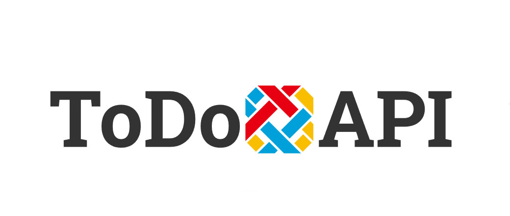
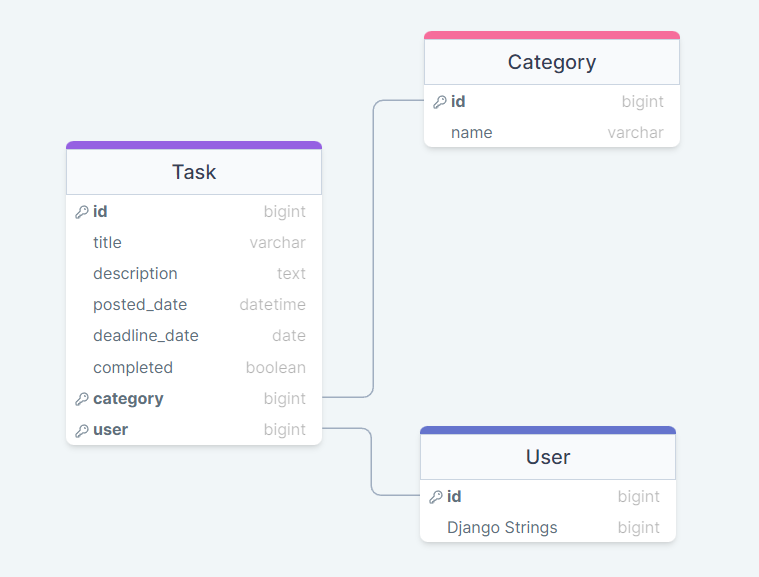
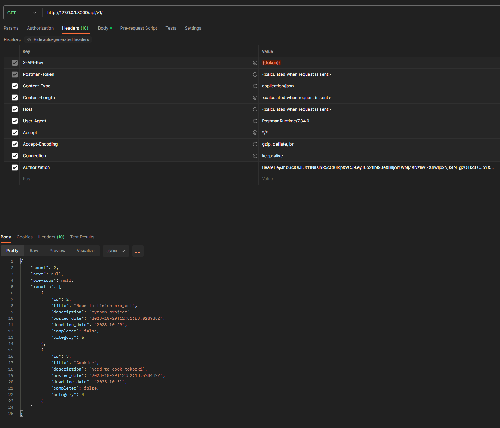
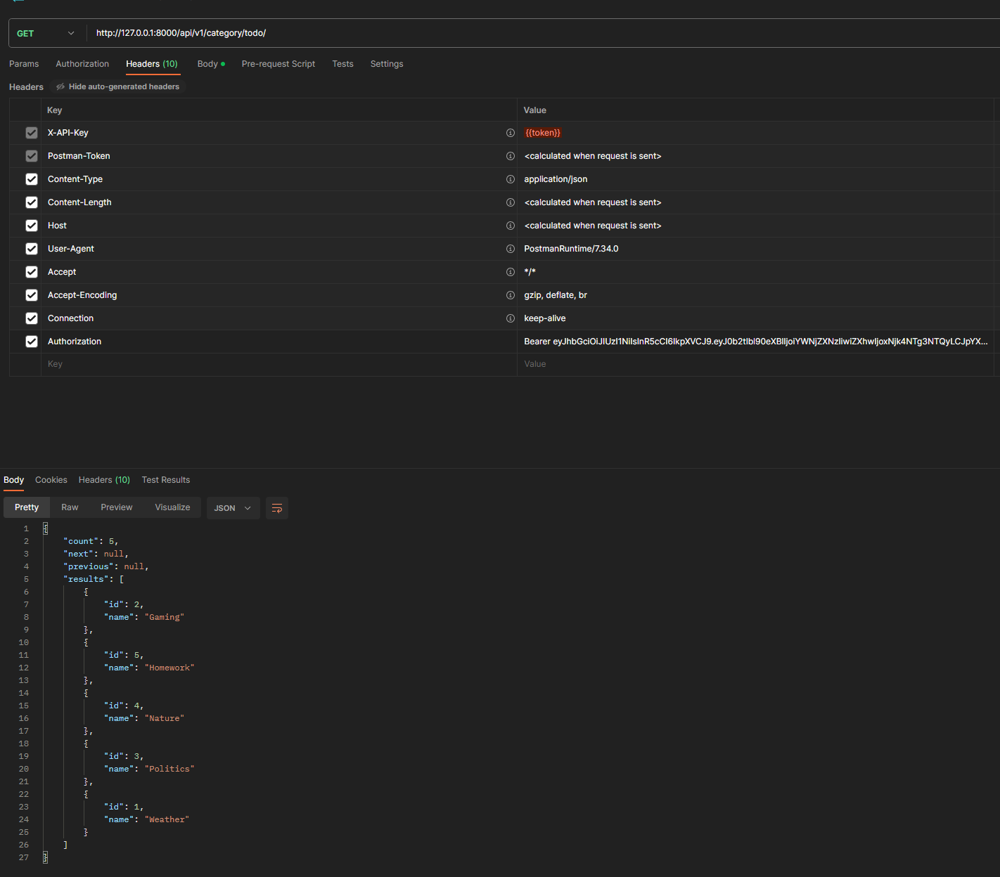
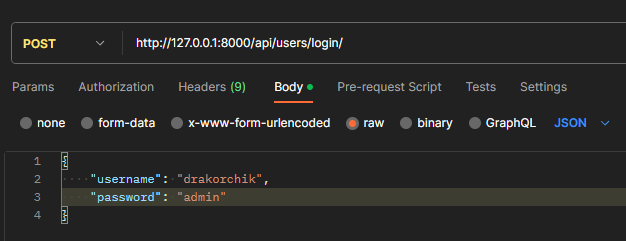
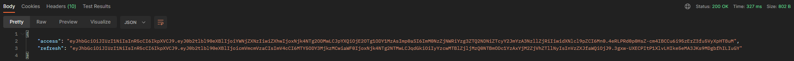
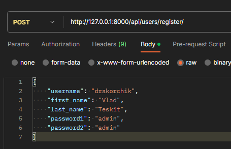
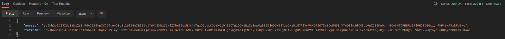

# ToDo API

This project was initiated for educational purposes, with the primary objective being to delve deeper into 
technologies such as Django, Django Rest Framework, MySQL, and Docker

# Technology Stack
* Python/Django/DRF
* MySQL
* Docker
* JWT-Auth

# Database(MySQL)


Our project has 2 self-written models

# API

## Tasks

In this project, you can perform the following actions using the provided URLs:

```
api/v1/ - Retrieve user tasks if the user is authorized.
api/v1/id_post/ - Update a task.
api/v1/create/ - Create a new task.
api/v1/delete/id_post/ - Delete a task.
api/v1/sort/category/category_id/ - Retrieve tasks filtered by category.
api/v1/sort/completed/ - Retrieve completed tasks.
```

## Category

Using this URL, you can perform the following actions:
```
api/v1/category/todo/ - check, update, create, delete categories if you are a superuser.
```
We accessed it through the use of routers.

## Auth





The login system was implemented using JWT.


# Summary
The ToDo API project was created for educational purposes to explore technologies like Python, Django, Django Rest Framework, MySQL, Docker, and JWT-Auth for authentication. It offers users the ability to manage tasks and categories:

Users can retrieve, update, create, and delete tasks through specific endpoints.
Completed tasks can be retrieved.
Tasks can be filtered by category.
Superusers can check, update, create, and delete categories.
The project utilizes Docker for easy deployment and JWT for secure authentication, making it a valuable educational experience in web development and API creation.